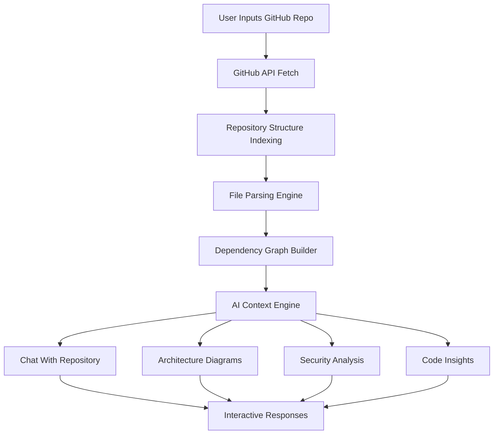
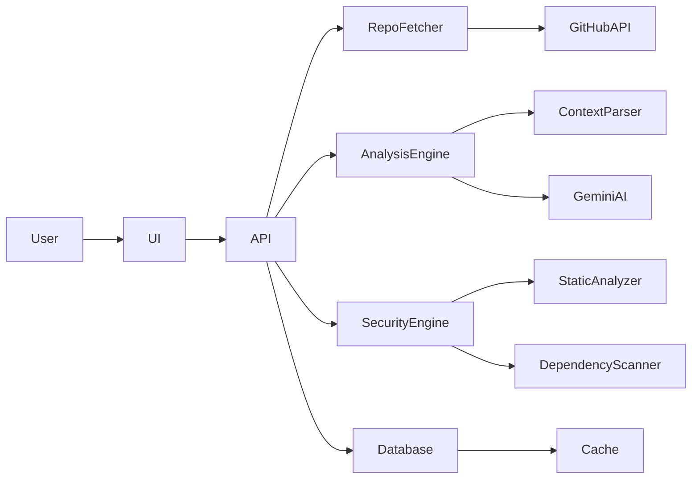

<div align="center">

# ⚡ GitPulse

### Dive into Open Source. Master Any Repo. Instantly.

An **AI-powered platform for understanding GitHub repositories and developer profiles**.

Chat with any repository, generate architecture insights, and run security scans — **without cloning the repo**.

<br>


<br><br>

**Understand any GitHub repository in seconds.**

</div>

---

# 🚀 What is GitPulse?

GitPulse transforms any GitHub repository into an **interactive AI-powered knowledge system**.

Instead of manually reading hundreds of files, developers can:

* Ask questions about the codebase
* Generate architecture diagrams
* Identify security vulnerabilities
* Understand dependencies and project structure

All directly **inside the browser**.

GitPulse works without cloning repositories locally — it analyzes code using **GitHub APIs, full-file context reasoning, and AI models**.

---

# ✨ Core Features

<div align="center">

| 🔍 Repo Intelligence             | 💬 Chat With Code         | 📊 Architecture Insights       |
| -------------------------------- | ------------------------- | ------------------------------ |
| Understand entire repo instantly | Ask questions about code  | Generate architecture diagrams |
| Full-file context analysis       | Locate logic across files | Visualize dependencies         |
| Detect patterns & structure      | Explain complex systems   | Flowcharts from real code      |

</div>

<br>

<div align="center">

| 🛡 Security Scanning      | 👨‍💻 Developer Insights   | ⚡ Instant Repo Analysis |
| ------------------------- | -------------------------- | ----------------------- |
| Detect vulnerabilities    | Analyze developer profiles | No cloning required     |
| Find hardcoded secrets    | View contribution patterns | Works via GitHub APIs   |
| Dependency risk detection | Explore top repositories   | Instant analysis        |

</div>

---

# 📸 Application Gallery

<div align="center">

<table>

<tr>
<td></td>
<td></td>
</tr>

<tr>
<td></td>
<td></td>
</tr>

<tr>
<td></td>
<td></td>
</tr>

<tr>
<td></td>
<td></td>
</tr>

</table>

</div>

---

# 🧠 Repository Intelligence Pipeline



### Explanation

The analysis pipeline works in multiple stages:

**1. Repository Fetch**

GitPulse fetches repository files and metadata through the GitHub API.

**2. File Indexing**

All files are indexed and organized into a structure graph.

**3. Context Parsing**

Instead of chunking files like RAG systems, GitPulse reads **full files**, preserving context.

**4. Dependency Graph Creation**

Imports and module relationships are analyzed to understand system architecture.

**5. AI Processing**

Gemini models reason about:

* repository architecture
* code patterns
* security vulnerabilities
* dependency flows

**6. Insight Generation**

Results are converted into:

* chat answers
* diagrams
* vulnerability reports
* repo summaries

---

# 🏗 System Architecture



### Explanation

**Frontend (Next.js)**

Handles:

* UI interactions
* repo chat interface
* architecture visualization
* security reports

---

**API Layer**

Acts as the orchestration layer responsible for:

* repo fetching
* triggering AI analysis
* security scanning
* caching results

---

**Analysis Engine**

Processes repository code and generates insights using AI.

---

**Security Engine**

Runs static analysis to detect vulnerabilities and insecure patterns.

---

**Database & Cache**

Prisma stores structured data while caching layers reduce repeated analysis time.

---

# ⚙️ Getting Started

### Prerequisites

* Node.js **18+**
* GitHub Token
* Gemini API Key

---

### Installation

```bash
git clone https://github.com/YOUR_USERNAME/gitPulse.git

cd gitPulse

npm install
```

---

### Environment Setup

Create `.env.local`

```
GITHUB_TOKEN=
GEMINI_API_KEY=
DATABASE_URL=
```

---

### Start Development Server

```bash
npm run dev
```

Open:

```
http://localhost:3000
```

---

# 🔮 Roadmap

Future improvements planned for GitPulse:

* repository dependency graphs
* pull request intelligence
* multi-repo analysis
* deeper vulnerability scanning
* contributor insights

---

<div align="center">

# 👨‍💻 Author

**Raghav Sharma**

⭐ If you like the project, consider giving it a star!

</div>
# GitAnalyze
# GitAnalyze
